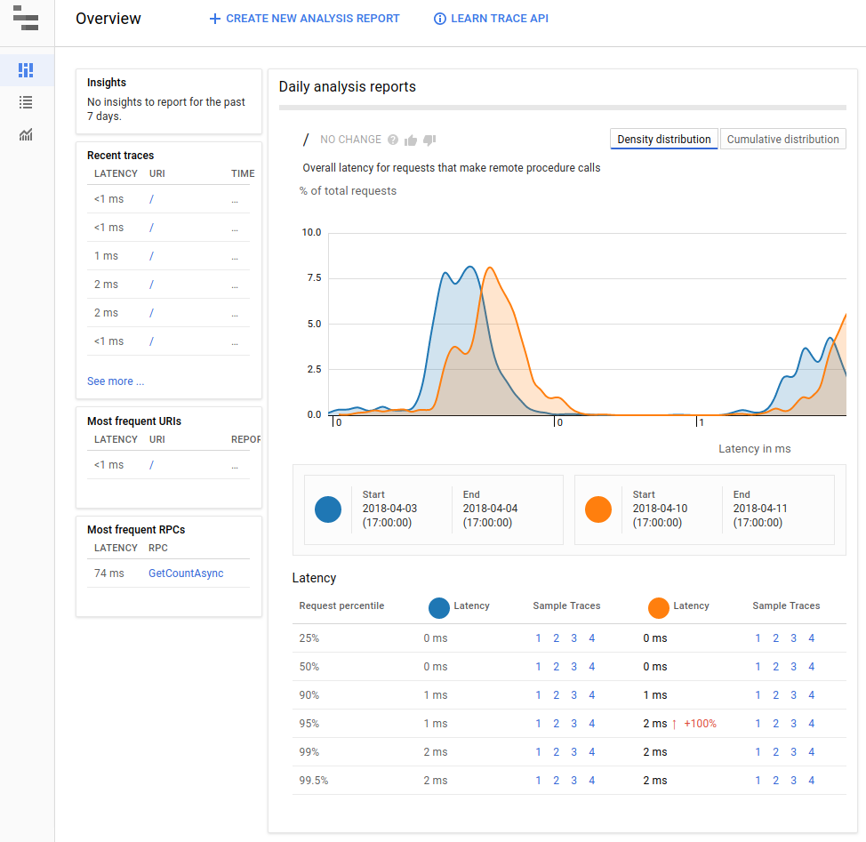

# Sudoku + Dumb = Sudokumb.

This is the companion sample for number of [medium.com stories](https://medium.com/@SurferJeff).

**Sudokumb** is a [Sudoku](https://en.wikipedia.org/wiki/Sudoku) solver. In order to demonstrate some cool features of <a href="https://cloud.google.com/">Google Cloud Platform </a>,
Sudokumb solves the puzzles in a very dumb way.

## Smart

Most of what Sudokumb does is actually pretty smart.

### <a name="datastore"> Sudokumb stores user info in Datastore.</a>

Sudokumb stores user information like email addresses and passwords in [Google Cloud Datastore](https://cloud.google.com/datastore/). To do so, it 
[implements](./DatastoreUserStore/DatastoreUserStore.cs) a 
[custom storage provider for identity](https://docs.microsoft.com/en-us/aspnet/core/security/authentication/identity-custom-storage-providers).

[Google Cloud Datastore](https://cloud.google.com/datastore/) is a fully managed, [NoSQL](https://en.wikipedia.org/wiki/NoSQL) database. Because it is fully managed, you never have to upgrade hardware or operating systems. There are no database instances for you to maintain. You only pay for the data you store, read, and write.

User data fits perfectly into [Google Cloud Datastore](https://cloud.google.com/datastore/), because user data is often read and rarely written.

### <a name="stackdriver"> Sudokumb logs and reports errors and traces to Stackdriver.</a>

When an exception is thrown in production, critical information for debugging the exception, like the stack trace, is hidden. 

Stackdriver collects details about every exception in a searchable database: 

Stackdriver also collects all your logs into a searchable database:

And stackdriver can show you trace information too:

### <a name="kms"> Sudokumb secures forms and cookies with [Key Management Service](https://cloud.google.com/kms/).</a>

ASP.NET core uses a [`IDataProtectionProvider`](https://docs.microsoft.com/en-us/dotnet/api/microsoft.aspnetcore.dataprotection.idataprotectionprovider?view=aspnetcore-2.0)
for cryptographic operations to validate forms authentication and to protect view state.
By default, ASP.NET core uses an `IDataProtectionProvider` based on a [machine key](https://docs.microsoft.com/en-us/aspnet/core/security/data-protection/compatibility/replacing-machinekey?view=aspnetcore-2.1)  However, if the ASP.NET application is deployed to a server farm,
then each machine gets its own machine key.

TODO: Explain more and add a drawing.

### <a name="appengine"> Sudokumb automatically scales on [App Engine](https://cloud.google.com/appengine/docs/flexible/dotnet/).</a>

Solving a Sudoku puzzle the dumb way is an intentinally CPU and network intensive task.
What happens when 20 users want to solve a puzzle at the same time?
[App Engine](https://cloud.google.com/appengine/docs/flexible/dotnet/)
automatically [spins up additional instances](https://cloud.google.com/appengine/docs/flexible/dotnet/an-overview-of-app-engine)
to handle the load spike, and then
spins down the instances when the load has returned to normal.

## Dumb

### <a name="pubsub> Sudokumb distributes tiny fragments of work via [Google Cloud Pub/Sub](https://cloud.google.com/pubsub/docs/).</a>

Distributing work across multiple machines is smart, but breaking up a tiny problem into trivial fragments and distributing them across multiple machines is dumb. The network overhead is orders of magnitude greater than just solving the problem in place.

However, creating lots of distributed work is a good demonstration of the power and scalability of [ Google Cloud Pub/Sub](https://cloud.google.com/pubsub/docs/).  Sudokumb can pump 100,000 messages per second through Pub/Sub
without a hiccup.
