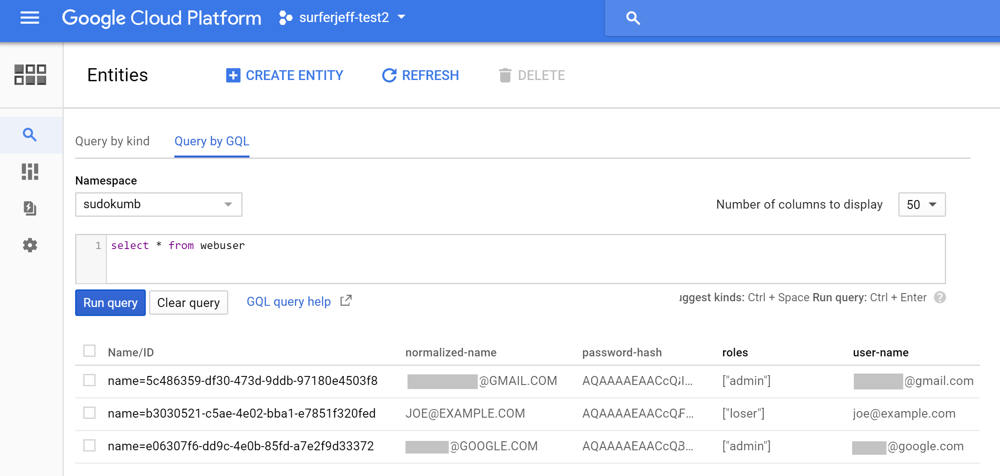
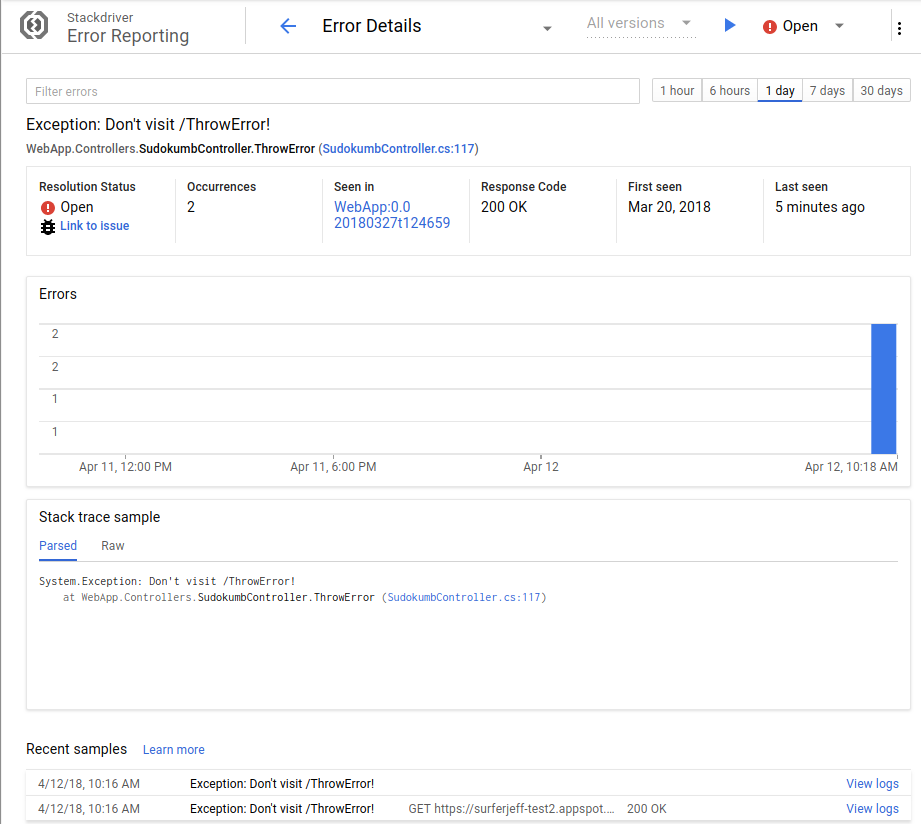

# Sudoku + Dumb = Sudokumb.

This is the companion sample for number of [medium.com stories](https://medium.com/@SurferJeff).

**Sudokumb** is a [Sudoku](https://en.wikipedia.org/wiki/Sudoku) solver. In order to demonstrate some cool features of <a href="https://cloud.google.com/">Google Cloud Platform </a>,
Sudokumb solves the puzzles in a very dumb way.

## Smart

Most of what Sudokumb does is actually pretty smart.

###  Sudokumb stores user info in Datastore.

Sudokumb stores user information like email addresses and passwords in [Google Cloud Datastore](https://cloud.google.com/datastore/). To do so, it implements a [custom storage provider for identity](https://docs.microsoft.com/en-us/aspnet/core/security/authentication/identity-custom-storage-providers).

[Google Cloud Datastore](https://cloud.google.com/datastore/) is a fully managed, [NoSQL](https://en.wikipedia.org/wiki/NoSQL) database. Because it is fully managed, you never have to upgrade hardware or operating systems. There are no database instances for you to maintain. You only pay for the data you store, read, and write.

User data fits perfectly into [Google Cloud Datastore](https://cloud.google.com/datastore/), because user data is often read and rarely written.



###  Sudokumb logs and reports errors and traces to Stackdriver.

When an exception is thrown in production, critical information for debugging the exception, like the stack trace, is hidden. 

Stackdriver collects details about every exception in a searchable database: 


Stackdriver also collects all your logs into a searchable database:


And stackdriver can show you trace information too:


###  Sudokumb automatically scales on [App Engine](https://cloud.google.com/appengine/docs/flexible/dotnet/).

TODO: add content here.

###  Sudokumb secures forms and cookies with [Key Management Service](https://cloud.google.com/kms/)
TODO: add content here.

## Dumb

### Sudokumb distributes tiny fragments of work.

While distributing work across multiple machines is smart, breaking up a tiny problem into trivial fragments and distributing them across multiple machines is dumb. The network overhead is orders of magnitude greater than just solving the problem in place.

 However, creating lots of distributed work is a good demonstration of the power and scalability of [ Google Cloud Pub/Sub](https://cloud.google.com/pubsub/docs/).

## Prerequisites

Yeah, there's a ton of prerequisites.  But every one of them is necessary.
Hang in there.

1.  **Follow the instructions in the [root README](../../../README.md).**
  
2.  Install the [.NET Core SDK, version 2.0](https://github.com/dotnet/core/blob/master/release-notes/download-archives/1.1.4-download.md).

6.  [Click here](https://console.cloud.google.com/flows/enableapi?apiid=cloudkms.googleapis.com&showconfirmation=true) 
	to enable [Google Cloud Key Management Service](https://cloud.google.com/kms/)
	for your project.

10. Edit [appsettings.json](appsettings.json).

	Replace `YOUR-PROJECT-ID` with your Google project id.


##  Using PowerShell

### Run Locally

```ps1
PS C:\dotnet-docs-samples\appengine\flexible\SocialAuth> dotnet restore
PS C:\dotnet-docs-samples\appengine\flexible\SocialAuth> dotnet run
```
### Deploy to App Engine

6.  Before deploying to app engine, you must copy your user secrets to your Google
project metadata with this powershell script:

	```psm1
	PS C:\dotnet-docs-samples\appengine\flexible\SocialAuth> .\Upload-UserSecrets
	```

7.  Deploy with gcloud:

	```psm1
	PS C:\dotnet-docs-samples\appengine\flexible\SocialAuth> gcloud beta app deploy .\bin\Release\PublishOutput\app.yaml
	```


##  Using Visual Studio

### Run Locally

6.  Before deploying to app engine, you must copy your user secrets to your Google
project metadata with this powershell script:

	```psm1
	PS C:\dotnet-docs-samples\appengine\flexible\SocialAuth> .\Upload-UserSecrets
	```

Open **SocialAuth.csproj**, and Press **F5**.

### Deploy to App Engine

1.  In Solution Explorer, right-click the **SocialAuth** project and choose **Publish SocialAuth to Google Cloud**.

2.  Click **App Engine Flex**.

3.  Click **Publish**.
